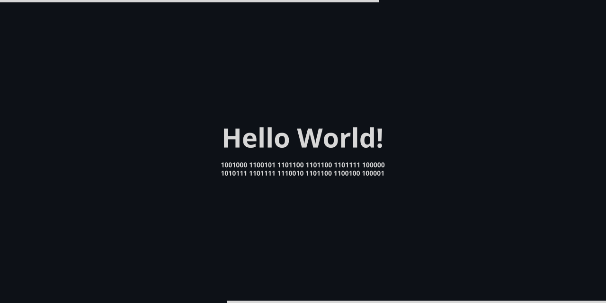

<!--https://github.blog/developer-skills/github/how-to-make-your-images-in-markdown-on-github-adjust-for-dark-mode-and-light-mode/#-->
<picture>
  <source media="(prefers-color-scheme: dark)" srcset="github-profile-banner-dark.png">
  <source media="(prefers-color-scheme: light)" srcset="github-profile-banner-light.png">
  
</picture>

# 👋 Hey There!
🌍 Europe 👨🏻‍💻 He/him.  
💻 Web design and web development (self-taught).  
🔨 I use HTML, CSS, PHP, MySQL, and JavaScript.  
🌱 I'm currently learning JS (JavaScript) and English.  
⚡ Fun fact: using CSS you can draw something, this is called CSS art.  
🗂️ Almost all projects in one place: [Website](https://irvirty.is-local.org/) or [Repository](https://github.com/irvirty/irvirty.pages.dev)  
  
<!--
---
  
> [!NOTE]
> This page was built using [GitHub](https://github.com/)  
  
---
-->

<!--
**username/username** is a ✨ _special_ ✨ repository because its `README.md` (this file) appears on your GitHub profile.

Here are some ideas to get you started:

- 🔭 I’m currently working on ...
- 🌱 I’m currently learning ...
- 👯 I’m looking to collaborate on ...
- 🤔 I’m looking for help with ...
- 💬 Ask me about ...
- 📫 How to reach me: ...
- 😄 Pronouns: ...
- ⚡ Fun fact: ...
-->
